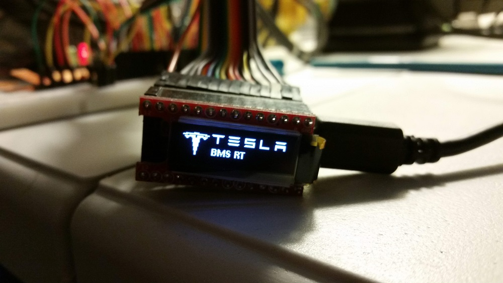

# teslaBMSBL

## dependencies
- TeensyView libs
	- https://github.com/sparkfun/SparkFun_TeensyView_Arduino_Library/tree/master/examples
	
## Error codes on teensyView

| code | definition | 
|:----:|------------|
| A | Modules Fault Loop |
| B | Battery Monitor Fault |
| C | BMS Serial communication Fault |
| D | BMS Cell Over Voltage Fault |
| E | BMS Cell Under Voltage Fault |
| F | BMS Over Temperature Fault |
| G | BMS Under Temperature Fault |
| H | BMS 12V Battery Over Voltage Fault |
| I | BMS 12V Battery Under Voltage Fault |
| J | BMS Water Sensor 1 Fault |
| K | BMS Water Sensor 2 Fault |

## Connection to USB serial console

Serial Line: COMX (X typically = 7)
Speed: 115200

## state machine:
[State machine](https://online.visual-paradigm.com/w/pmcoivfe/diagrams.jsp#diagram:proj=0&id=3)
## todo
- [x] Change state machine to match actual charger controller behavior. 
- [ ] sleep modes for the teensy
	- [ ] full speed run in charging and run modes, 5s sleep otherwise.
	- [ ] allow an option in the console to disable sleep for 1h to allow debugging.

	
