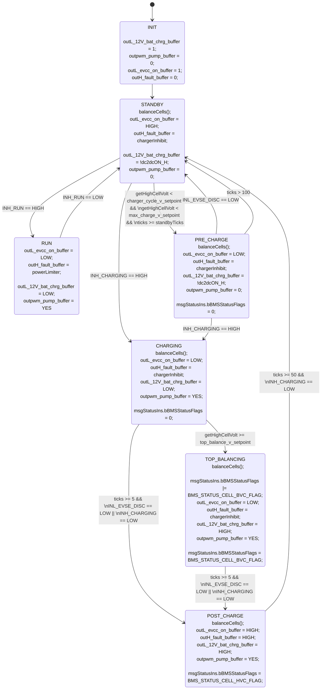

# teslaBMSBL

## Hardware

see eagle files to build the board hosting the teensy 3.2.

## dependencies

- TeensyView libs
  - <https://github.com/sparkfun/SparkFun_TeensyView_Arduino_Library/tree/master/examples>
- Snooze for lower power consumption
  - <https://github.com/duff2013/Snooze>

## Error codes on teensyView

| code | definition |
|:----:|------------|
| A | Modules Fault Loop |
| B | Battery Monitor Fault |
| C | BMS Serial communication Fault |
| D | BMS Cell Over Voltage Fault |
| E | BMS Cell Under Voltage Fault |
| F | BMS Over Temperature Fault |
| G | BMS Under Temperature Fault |
| H | BMS 12V Battery Over Voltage Fault |
| I | BMS 12V Battery Under Voltage Fault |
| J | BMS Water Sensor 1 Fault |
| K | BMS Water Sensor 2 Fault |
| L | Incorrect modules count |

## Connection to USB serial console

Serial Line: COMX (X typically = 7)
Speed: 115200

## controller state machine

<!-- [State machine](https://online.visual-paradigm.com/w/pmcoivfe/diagrams.jsp#diagram:proj=0&id=3) -->

## todo

- [X] none

## particularities

Due to the 5s deepsleep mode in standby, it is hard to connect the serial console. To make it easier, either connect within 10 minutes of a reset or place the bms in run mode and connect.
Due to the deepsleep mode, it is impossible to simply reprogram the teensy following the first sleep. To facilitate reprogramming, the board will not sleep for 10 minutes following a reset.
The teensyview cannot be shut down as it is connected straight to the VDD pins.
